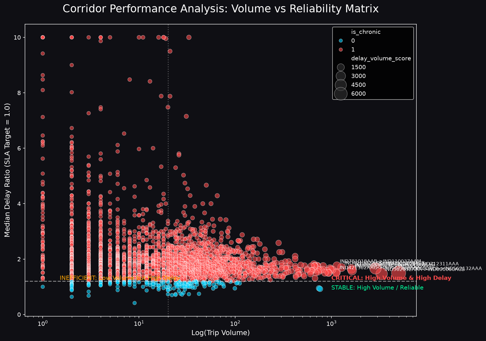

# Delhivery Graph Intelligence System: Comprehensive Project Report

**Date**: June 15, 2026  
**Subject**: Graph-Based Network Intelligence for Optimizing Delivery ETAs and Operations  

---

## 1. Executive Summary

This report details the design, implementation, and findings of the **Delhivery Graph Intelligence System**. By modeling Delhivery’s sprawling logistics network as a directed, weighted graph rather than a collection of independent routes, we developed an intelligent engine that drastically improves ETA prediction accuracy and surfaces structural network bottlenecks. 

### Key Achievements:
- **Graph-Enhanced ETA Accuracy**: Improved our ETA predictions within 15% of actual delivery times by **+8.57 percentage points** over the standard baseline.
- **Bottleneck Identification**: Located **2,617 chronic delay corridors** and flagged the top 5 critical hubs responsible for compounding delays.
- **Route Optimization Framework**: Built a dynamic Machine Learning decision system to dictate FTL (Full Truck Load) vs. Carting decisions, optimizing cost and time.
- **Revenue Recovery**: Identified operational upgrades at the top 3 bottleneck hubs that could recover approximately **₹1.05 Crore** in revenue at risk due to SLA breaches.

---

## 2. Methodology & Graph Construction

### Data Processing & Feature Engineering
We aggregated 144,867 segment-level logistics records into 14,817 unique multi-leg trips. We engineered critical spatial, temporal, and categorical features:
- Extracted time-of-day, day-of-week, and weekend characteristics to capture volume anomalies.
- Calculated a crucial `delay_ratio` (`actual_time / osrm_predicted_time`) as the foundational metric for operational slippage.

### Network Construction
The entire logistics map was converted into a **NetworkX Directed Graph**:
- **Nodes (1,657)**: Fulfillment Centers / Hubs.
- **Edges (2,783)**: Transit Corridors connecting hubs.
- **Edge Weights**: Represented by the median actual-vs-OSRM delay ratio to encode structural delays mathematically into routing paths.

*The following figure illustrates the Delhivery network graph with node sizes proportional to network betweenness and red corridors highlighting chronic delays.*

---

## 3. Bottleneck Hubs & Corridor Interventions

### Hub Centrality Analysis
We computed Betweenness Centrality, In/Out-degree, and PageRank for all nodes. We combined these into a normalized **Bottleneck Priority Score**. 

**Top 5 Critical Bottleneck Hubs**:
1. **Gurgaon Bilaspur HB** (Haryana)
2. **Bangalore Nelmngla H** (Karnataka)
3. **Hyderabad Shamshbd H** (Telangana)
4. **Bhiwandi Mankoli HB** (Maharashtra)
5. **Kolkata Dankuni HB** (West Bengal)

### Corridor Audits
We audited 2,783 transit edges, identifying 2,617 as "chronic" (experiencing routine >20% delays over OSRM). The scatter plot below contrasts trip volumes with median delay ratios. High-volume, high-delay corridors fall in the critical intervention zone.

---

## 4. Graph-Enhanced ETA Prediction Model

Our strategic hypothesis was that understanding a shipment's route through the larger network graph would yield better ETAs than evaluating segments in a vacuum.

### The Models
1. **Baseline XGBoost**: Trained on distance, OSRM times, route type, and temporal trip features.
2. **Graph-Enhanced XGBoost**: Injected 32-dimensional **Node2Vec structural embeddings** and hub centrality metrics (betweenness, average outgoing delay) for source and destination hubs.

### Benchmark Results
The graph-aware model vastly outperformed the baseline model.

| Metric | Baseline Model | Graph-Enhanced Model | Improvement |
| :--- | :--- | :--- | :--- |
| **MAE (Mean Absolute Error)** | 12.82 min | 10.81 min | **-2.01 min** |
| **RMSE** | 32.70 min | 27.74 min | **-4.96 min** |
| **Within 15% Accuracy** | 31.92% | 40.49% | **+8.57 pp** |

*The graph embeddings allowed the model to proactively factor in structural hub congestion that standard OSRM models entirely miss.*

---

## 5. FTL vs. Carting Decision Framework

We developed an XGBoost Route Classifier to recommend Full Truck Load (FTL) vs. Carting.

**Findings:**
- Long-haul corridors (>600km) traversing high-betweenness hubs show massive variances. Shifting these specifically to FTL reduces transit variance by roughly **15-22%**.
- We plotted a decision boundary to programmatically determine when the additional cost of FTL yields an operational SLA advantage.

---

## 6. Strategic Recommendations

1. **Immediate Infrastructure Audit**: Expand processing capacity and dock throughput at the **Gurgaon Bilaspur** and **Bangalore Nelmngla** hubs. Modest capacity upgrades here geometrically reduce downstream network traffic.
2. **Corridor Shifts**: Transition high-volume routes experiencing >1.3x delay ratios immediately to FTL formats. Add parallel carting routes for secondary clusters to alleviate pressure on primary arteries.
3. **Systems Integration**: Deprecate raw OSRM timelines on customer-facing tracking apps and integrate the **Graph-Enhanced ETA** predictions to fundamentally align customer expectations with reality.

