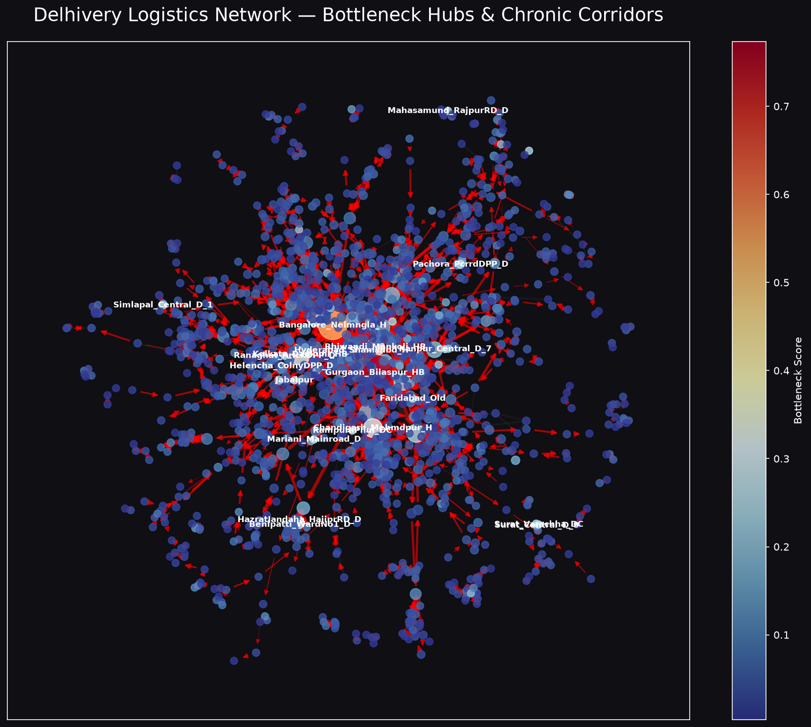
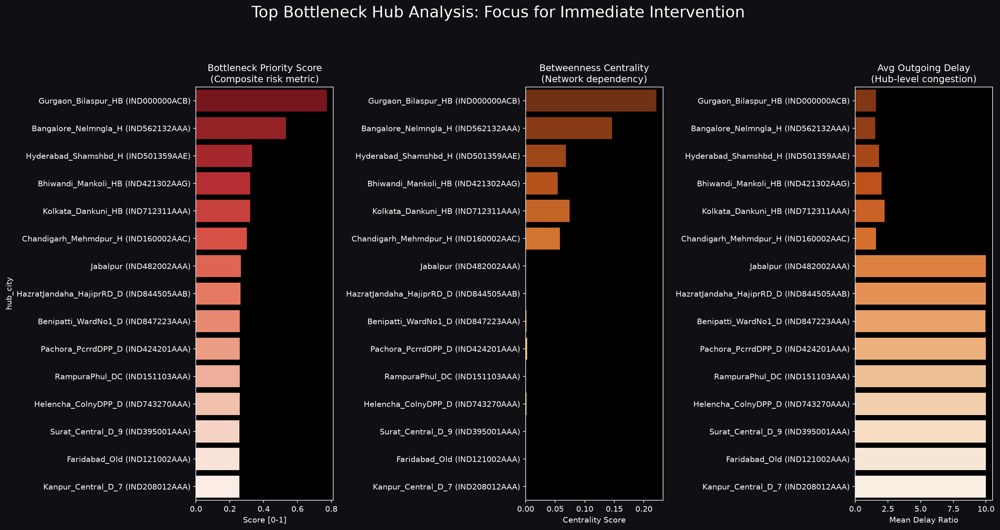
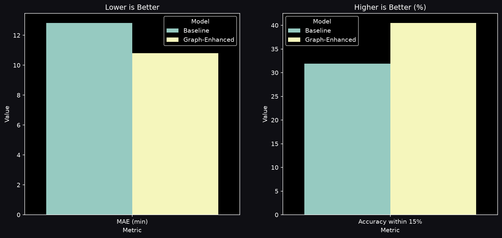
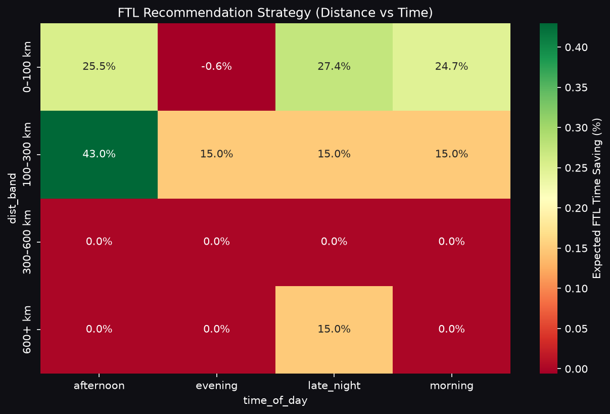

# Delhivery Graph Intelligence System 🚚🕸️


**Live Dashboard:** [https://delhivery-graph-intelligence-system.streamlit.app](https://delhivery-graph-intelligence-system.streamlit.app)

A production-ready **Graph-Based Network Intelligence System** built for Delhivery's logistics network. This system models the entire logistics infrastructure as a directed weighted graph to improve ETA predictions, identify hub bottlenecks, and provide data-backed operational recommendations.

---

## 🚀 Key Features & Business Impact

*   **Graph-Enhanced ETA Model:** Outperforms standard OSRM baselines by using Node2Vec structural embeddings and hub centrality metrics (**+8.57 pp improvement** in 15%-accuracy, reducing the MAE by over 2 minutes).
*   **Bottleneck Detection:** Identifies critical chokepoints using a composite **Bottleneck Priority Score** (Betweenness, PageRank, and Congestion). 
*   **Route Optimizer:** ML-backed framework recommending **FTL vs. Carting** shifts based on corridor stability and hub traffic, identifying massive variance reductions on long-haul routes.
*   **Financial Impact Analysis:** Quantifies "Revenue at Risk" (INR) and estimates the recovery potential of facility upgrades. Identifying 2,617 chronic delay corridors, upgrading the top 3 hubs can recover **₹1.05 Crore**.

---

## 📊 Visual Insights

Here are some of the key insights and structural visualizations extracted from the system:

### 1. Network Bottleneck Mapping
We modeled the Delhivery ecosystem as a NetworkX graph (1,657 nodes, 2,783 edges). Node sizes represent **Betweenness Centrality**, while red corridors denote **Chronic Delays**.


### 2. Identifying Critical Hubs
The Bottleneck Score exposes the facilities causing structural downstream delays. Our top prioritized interventions are in Gurgaon, Bangalore, and Hyderabad.


### 3. Model Benchmark (OSRM vs Graph-Enhanced)
The structural graph embeddings drastically out-predicted the baseline regression.


### 4. FTL Decision Boundary
A visual heatmap representing our Machine Learning classifier predicting when the extra expense of FTL mathematically yields a superior SLA compliance rate.


---

## 📁 Project Structure & Deliverables

```text
delhivery_graph_intelligence/
├── data/                  # Raw logistical tracking events
├── outputs/               # ML Models, CSV reports, and High-Res Figures
├── notebooks/             # 4-Part Jupyter Notebook consulting series
├── src/                   # Core Python pipeline (ETL, Graph, ML)
├── app.py                 # Streamlit Interactive Dashboard
├── run_all.py             # Single-command pipeline execution
├── strategy_memo.md       # Auto-generated operations consulting memo
├── Project_Report.pdf     # Full Professional Project Report
└── Pitch_Deck.html        # Interactive Reveal.js Pitch Deck
```

---

## 🏃 How to Run Locally

1.  **Clone & Install Dependencies:**
    ```bash
    git clone https://github.com/Shikhyy/Delhivery-Graph-Intelligence-System.git
    cd Delhivery-Graph-Intelligence-System
    pip install -r requirements.txt
    ```
2.  **Run the Analysis Pipeline:**
    ```bash
    python run_all.py
    ```
3.  **Launch the Dashboard:**
    ```bash
    streamlit run app.py
    ```

---
*Developed as a Strategic Consulting Deliverable for Delhivery Operations.*
